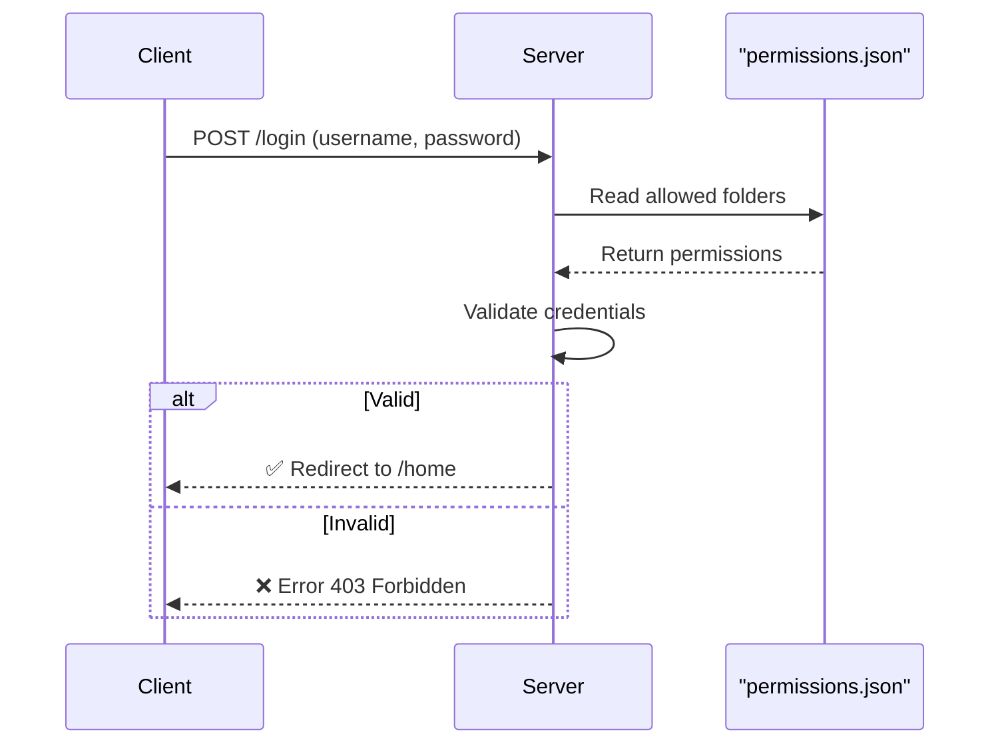

<p align="center">
  
</p>

<h1 align="center">🎶📂 Local File Streamer 🎥💻</h1>

<p align="center">
  <strong>Turn your Windows PC into a personal, secure, multi-user media server.</strong><br/>
  Stream, browse, and manage your files locally — no cloud, no subscriptions, no compromises.
</p>

<p align="center">
    
    
    
    
    
</p>

---

## 🚀 Why Local File Streamer?

Local File Streamer is more than just a file server. It’s a **private, offline media hub** built with privacy and performance in mind.

✨ **Highlights:**
- ⚡ **One-click standalone executable** → no installs, no dependencies.  
- 🎬 **On-the-fly media processing** → switch audio & subtitles instantly.  
- 🛡 **Granular access control** → per-user folders & QR-based quick access.  
- 🔒 **Privacy-first & offline** → your files stay **inside your network**.  

---

## 📸 Screenshots

| 🖥️ Launcher | 📱 Web Browser | 🎞️ Video Player |
|-------------|----------------|-----------------|
|   |  |   |

---

## ✨ Feature Breakdown

<details>
<summary>🖥️ Host Application (Windows EXE)</summary>

- 🖥 **Modern GUI (PyQt6)** → Start/Stop server with live logs.  
- 👥 **Multi-User Management** → Create users & assign folders.  
- 📁 **Granular Folder Permissions** → per-user restricted access.  
- 🔑 **Access Modes** →  
   - Secure login accounts  
   - Full access (QR-based)  
   - Open-for-all LAN access  
- 📡 **mDNS Discovery** → use `http://your-pc.local` instead of IP.  
- 🪪 **QR Code Access** → scan & connect instantly.  

</details>

<details>
<summary>🌐 Web Client (Browser Interface)</summary>

- 🎬 **Video Streaming** (`.mkv`, `.mp4`, etc.) with seeking.  
- 🔊 **Audio Track Switching** → change languages/commentary live.  
- 📖 **Subtitle Switching** → choose `.srt` / `.ass` on the fly.  
- 🖼 **File Viewers** → images, PDFs open in-browser.  
- 📥 **Downloads** → fetch any file directly.  
- 🚀 **Remote Execution** → launch `.exe` / `.bat` securely on host.  

</details>

---

## 🛠️ Tech Stack

| Layer        | Technology |
|--------------|------------|
| Backend      | 🐍 Python + Flask |
| Server       | 🍰 Waitress (production WSGI) |
| GUI          | 🖥️ PyQt6 |
| Media Engine | 🎥 FFmpeg (bundled) |
| Packaging    | 📦 PyInstaller |

---

## 🏗️ System Architecture  

### 📌 Component Diagram
```mermaid
graph TD
    subgraph "Windows Host"
        A["main.exe (PyQt6 GUI)"]
        B["Flask Server (Waitress)"]
        C["FFmpeg Engine"]
        D["Host File System"]
        A --> B
        B --> D
        B --> C
    end

    subgraph "Client Device"
        E["Web Browser UI"]
    end

    B --> E
    C --> B
````

---

### 📌 Data Flow (Streaming a Video)

```mermaid
graph TD
    U["Client Browser"] -- "GET /stream/video.mkv" --> S["Server"]
    S -- "Reads video.mkv" --> FS["Host File System"]
    S -- "Spawns" --> FFMPEG["FFmpeg"]
    FFMPEG -- "Reads video.mkv" --> FS
    FFMPEG -- "Sends Stream" --> S
    S -- "Streams Data" --> U
```

---

### 📌 Sequence: User Login



---

## 🧩 Challenges & Solutions

| Challenge                  | ❌ Problem                    | ✅ Solution                                                             |
| -------------------------- | ---------------------------- | ---------------------------------------------------------------------- |
| Crashes from FFmpeg load   | GUI & server in same process | Moved server to **separate process** via multiprocessing               |
| FFmpeg not found in `.exe` | Packaged path missing        | Detect `sys._MEIPASS` → load bundled binaries                          |
| Path traversal risks       | Users escaping assigned dirs | Added **secure virtual → real path resolver** with `commonpath` checks |

---

## ⚖️ Pros & Cons

✅ **Pros**

* Super easy: one `.exe`
* Advanced features like Plex/Jellyfin but lighter
* No internet needed, fully private

⚠️ **Cons**

* CPU heavy for remuxing multiple streams
* Windows-only for now
* No full transcoding (e.g., HEVC → H.264)

---

## 📜 License

[MIT License](./LICENSE) © 2025 Pawan Kumar Rajak


---


